### GoCodeColorado Submission

This report was prepared for the GoCodeColorado 2019 Competition. The below report was my portion of the study, looking at business formation and real per capita GDP across the state of Colorado and seven (7) metro areas. As a team we also looked at the change in degree types and financial aid from 2001-2017 for the state and each metro area. The data used for this part of the study included business formation data, population data, gross domestic product (GDP) data, and real per capita gross domestic product (GDP) data between 2001 and 2017.

# Breakdown of Business Entity Data

We looked at business entity formation data to get an idea of whether start-ups were growing or shrinking in Colorado and the specific metro areas. We wanted to see if areas with higher number of start-ups saw an increase in per capita GDP. We used per capita GDP as our target metric because it measures the total output of the economy while accounting for population growth or decline within those areas. We used the real per capita GDP so that we had a specific dollar value to tie it to to control for inflation over time. For this section we used data from many sources including but not limited to the Colorado Department of State, U.S. Bureau of Economic Analysis, Federal Reserve Bank of St. Louis, and the Colorado Department of Local Affairs. From these sources we used population data, state GDP data, business entity formation data, and real per capita GDP data for state and metro areas.  

Our main dataset was the Business Entity Dataset from CDOS - Colorado Department of State, a CIM dataset. From here we focused our study on the years 2001-2017 in order to match it with the Degrees Awarded dataset. We then found data to match this time period for state population, state GDP (current dollars), and state and metro area real per capita GDP (chained 2012 dollars for state GDP and chained 2009 dollars for metro area GDP) to complete our analysis. We decided to focus on seven (7) metro areas across Colorado, including Denver-Aurora-Lakewood, Boulder, Colorado Springs, Fort Collins, Grand Junction, Greeley, and Pueblo.

## Cleaning and Preparing the Data

We started by cleaning and preparing the data. Initially, our dataset consisted of 1,848,357 rows (businesses formed) and 35 columns of data. The first record of an entity formation date started at 03/05/1864 and the last entity formation data was 4/11/2019.

We then checked for null values using some code and then the missingno matrix plot.

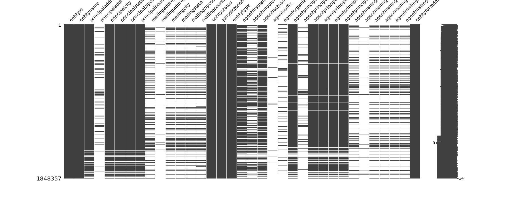

We then dropped all unnecessary columns and rows from the dataset to focus on our intended time period and saved a new clean csv with that data. Then we filtered the data and dropped any unnecessary rows in order to target the metro areas. We did this by creating a dictionary mapping the metro area to all zip codes contained within that metro area. Once we had that data cleaned and prepped, we created a new csv file with that data.

Reference: The cleaning and preparation of the business dataset can be found in the go-code-co_data_clean Jupyter Notebook.  

## State Business Entity, Population, and Gross Domestic Product (GDP) Summary Data for Entire Time Period 2001-2017

Total Number of Businesses Formed 2001-2017: 1,147,849

Status of Businesses Formed:

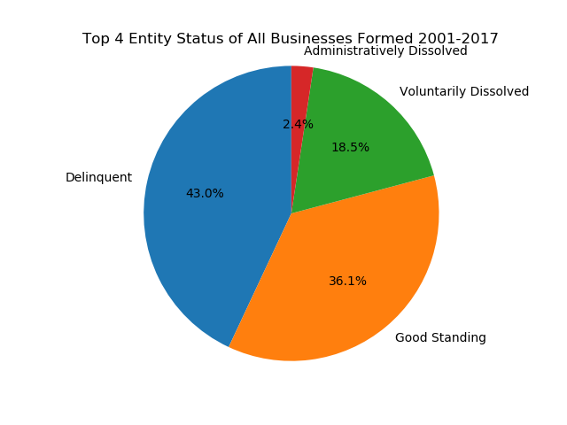

Entity Status  | Total Businesses | Percent of Total
------------- | ------------- | -------------
Delinquent  | 486725 | 42.40%
Good Standing  | 408635  | 35.60%
Voluntarily Dissolved  | 208854  | 18.20%
Administratively Dissolved  | 27006  | 2.35%
Noncompliant  | 12288  | 1.07%
Withdrawn  | 2159  | 0.19%
Exists  | 2066  | 0.18%
Dissolved (Term Expired)  | 99  | 0.01%
Judicially Dissolved  | 16  | 0.00%
Effectiveness Prevented  | 1  | 0.00%

Type of Businesses Formed:

Entity Type  | Total Businesses | Percent of Total
------------- | ------------- | -------------
Limited Liability Company  | 864556 | 75.32%
Corporation  | 211689  | 18.44%
Nonprofit Corporation  | 50853  | 4.43%
Limited Liability Partnership  | 6931  | 0.60%
Limited Liability Limited Partnership  | 6062  | 0.53%
Limited Partnership  | 4293  | 0.37%
General Partnership  | 2146  | 0.19%
Limited Partnership Association  | 374  | 0.03%
Cooperative  | 316  | 0.03%
Unincorporated Nonprofit Association  | 267 | 0.02%
Corporation Sole | 173 | 0.02%
Limited Cooperative Association | 100 | 0.01%
Cooperative Association | 79 | 0.01%
Foreign Limited Liability Company | 4 | 0.00%
Ditch Company | 4 | 0.00%
Foreign Other | 1 | 0.00%
Foreign Corporation | 1 | 0.00%

Number of Businesses Formed Per Year:

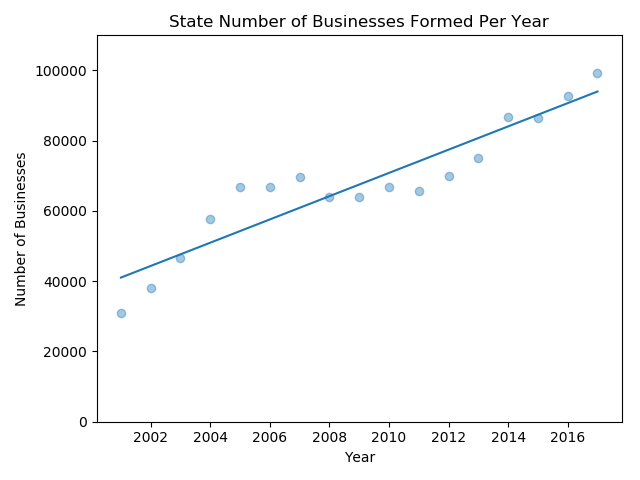 | 
----- | -----
Number of Businesses Formed Per Year | Number of Businesses Per 1000 Residents

State Population Trends:

 | 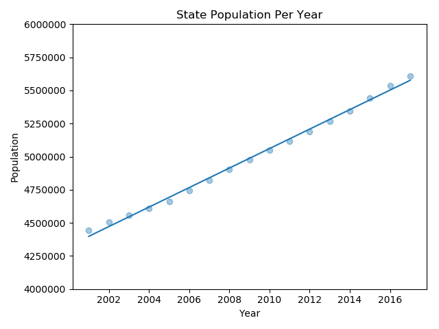
----- | -----
State Population | State Population Trend with Linear Regression Line Zoomed-in

State Gross Domestic Product (GDP) Trends:

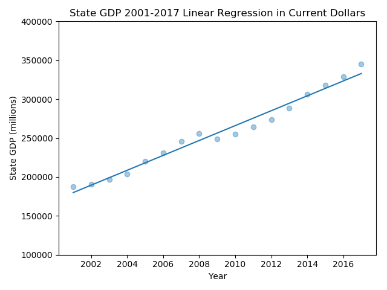 | 
----- | -----
State GDP (current dollars) | State Real Per Capita GDP Trend (chained 2012 dollars)

###### Interpretation

The total number of businesses formed in the state of Colorado from 2001-2017 was 1,147,849. Out of the total number of businesses formed, 36.1% were still in good standing when the dataset was used in 2019. This means that approximately 64% of businesses are no longer in good standing and may be considered failed in most cases. Most companies formed were Limited Liability Companies with 76.7% of the overall share. Corporations were the second most popular at 18.8%.

When looking at the number of businesses formed per year, we looked at the raw count and then controlled for population growth by looking at how many companies were formed per 1000 residents. The raw numbers show approximately 30,000 businesses formed in 2001, and almost 100,000 new businesses in 2017. This is over 3x the amount of companies created in 2017 versus 2001. When controlled for population we saw approximately seven (7) companies per 1000 residents formed in 2001 and almost eighteen (18) companies for every 1000 residents in 2017. This shows that people are creating more new companies in the latter years versus any other time before.

Looking at the population trends for the state we see a linear growth pattern. The population of the state has been growing steadily from 2001 to 2017.

State GDP was looked at using GDP in current dollars, which showed an upward trend, but based on the population growth we expected this. So we then controlled for population growth by looking at the state real per capita GDP chained to 2012 dollars. When we looked at the per capita GDP, we saw less growth, but still a slight upward trend from 2001 to 2017, meaning that economic output has been increasing.

## Breakdown of Metro Areas 2001-2017

After looking at state-wide data, we decided to break out seven (7) metro areas and compare them to each other using the state data as a benchmark. We looked at entity status, entity type and real per capita GDP chained to 2009 dollars. Unfortunately, we were not able to find reliable population data that matched our areas as well as timeline so we were not able to compare the number of businesses per 1000 residents to the state's analysis.

Metro Areas:
* Boulder
* Colorado Springs
* Denver (Denver-Aurora-Lakewood)
* Grand Junction
* Greeley
* Fort Collins
* Pueblo

#### Boulder Metro Area

Total Number of Businesses Formed in Boulder 2001-2017:  87,542

Status of Businesses Formed:

Entity Status  | Total Businesses
------------- | -------------
Good Standing  | 33,499  
Delinquent | 33,278
Voluntarily Dissolved  | 17,476  
Administratively Dissolved  | 2,196

Type of Businesses Formed:

Entity Type  | Total Businesses
------------- | -------------
Limited Liability Company  | 68,603
Corporation  | 13,957  
Nonprofit Corporation  | 3,672

Number of Businesses Formed Per Year:

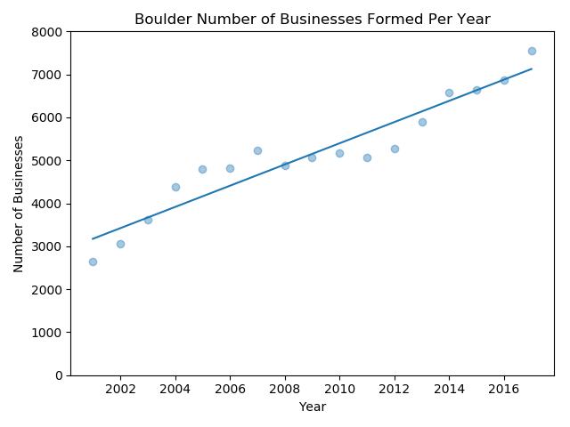

Real Per Capita GDP (chained 2009 dollars) Trends:

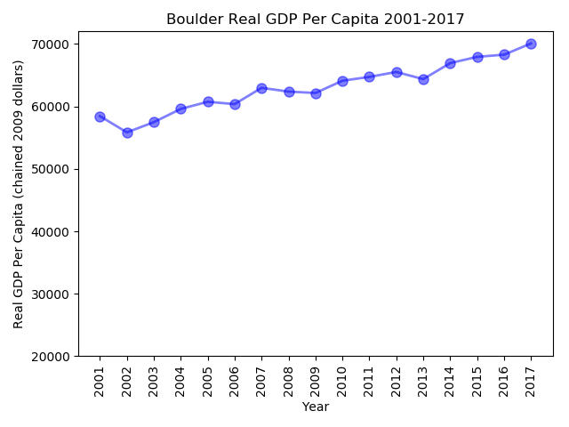 | 
----- | -----
Real Per Capita GDP | Real Per Capita GDP Zoomed-in

###### Interpretation

The total number of businesses formed in the Boulder Metro Area from 2001-2017 was 87,542. This is approximately 8% of the total companies in our study. Out of the Boulder companies formed, the highest category of status is Good Standing with 38.8% of businesses and the second highest is Delinquent at 38.5% of businesses. When looking at the types of companies formed during this time period, Limited Liability Companies are by far the preferred type with 79.6% of the total. Corporations are second with 16.2% of the companies. The number of companies has gone up substantially since 2001. In 2001 there were approximately 2,800 companies formed and in 2017 this number grew to approximately 7,500. Then we looked at real per capita GDP for Boulder and saw a pretty steady upward trend since a low in 2002.

###### Comparison

When comparing Boulder to the State, Boulder has a higher percentage of businesses in Good Standing, a higher percentage of Limited Liability Companies and a Lower percentage of Corporations. Boulder has a strong upward trend in the number of companies being formed per year. And Boulder has a higher real per capita GDP than the state average. This makes us believe that Boulder would be a good place to start a company due to its strong economy, increase in business formations, and percentage of companies in Good Standing. However, you may need to pay more than average for talent in this area due to the higher standard of living as indicated by the real per capita GDP.

#### Colorado Springs Metro Area

Total Number of Businesses Formed in Colorado Springs 2001-2017:  110,486

Status of Businesses Formed:

Entity Status  | Total Businesses
------------- | -------------
Delinquent | 48,004
Good Standing  | 38,082  
Voluntarily Dissolved  | 20,426  
Administratively Dissolved  | 2,261

Type of Businesses Formed:

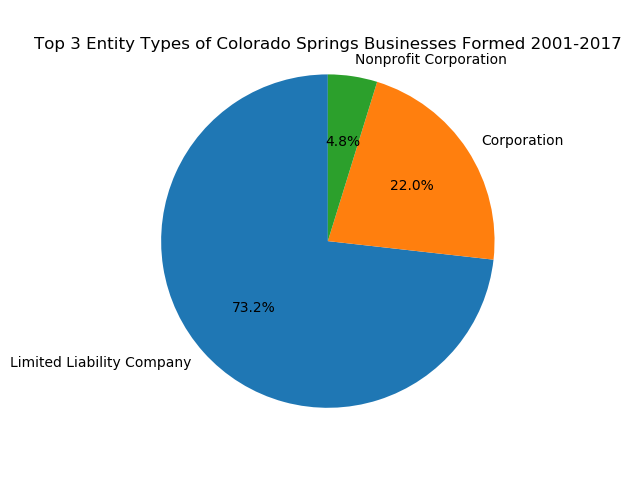

Entity Type  | Total Businesses
------------- | -------------
Limited Liability Company  | 79,255
Corporation  | 23,811
Nonprofit Corporation  | 5,169

Number of Businesses Formed Per Year:

Real Per Capita GDP (chained 2009 dollars) Trends:

 | 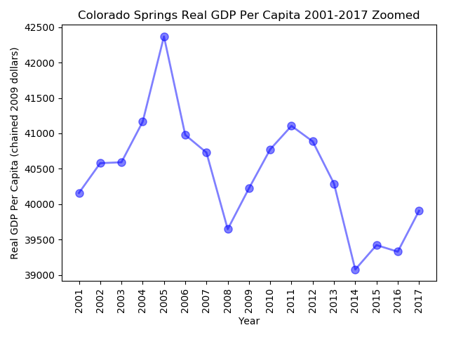
----- | -----
Real Per Capita GDP | Real Per Capita GDP Zoomed-in

###### Interpretation

The total number of businesses formed in the Colorado Springs Metro Area from 2001-2017 was 110,486. This is approximately 10% of the total companies in our study. Out of the Colorado Springs companies formed, the highest category of status was Delinquent with 44.1% of all companies in the area and Good Standing was second at 35.0% of all companies in the area. When looking at the types of companies formed during this time period, Limited Liability Companies were the preferred type with 73.2% of companies. Corporations were second with 22.0% of companies. The number of companies formed per year has gone up substantially since 2001. In 2001 there were approximately 2,800 companies formed and in 2017 this number grew to approximately 10,000. Then we looked at real per capita GDP for Colorado Springs and found a peak high in 2005 at 42,500 and then a decline to approximately 39,000 in 2014. Since 2014, Colorado Springs has seen real per capita GDP on the rise, with 2017 at approximately 40,000.

###### Comparison

When comparing Colorado Springs to the State, it has a higher percentage of businesses in a Delinquent state, and a lower percentage of companies in Good Standing. It has a lower percentage of Limited Liability Companies and a higher percentage of Corporations. Colorado Springs has a strong upward trend in the number of companies being formed per year. However, Colorado Springs has a lower real per capita GDP than the state average, but it has been trending upward since 2014. This makes us believe that Colorado Springs strengths include a strengthening economy by evidence of the high number of new businesses formed year over year.

#### Denver (Denver-Aurora-Lakewood) Metro Area

Total Number of Businesses Formed in Denver 2001-2017: 615,787

Status of Businesses Formed:

Entity Status  | Total Businesses
------------- | -------------
Delinquent | 274,455
Good Standing | 205,182
Voluntarily Dissolved | 111,268
Administratively Dissolved | 15,979

Type of Businesses Formed:

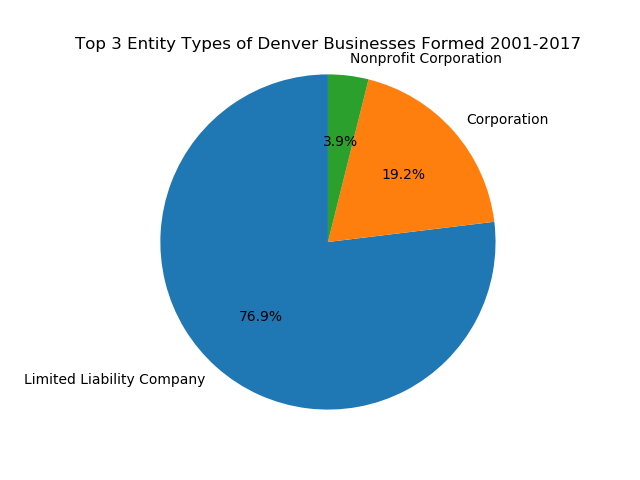

Entity Type  | Total Businesses
------------- | -------------
Limited Liability Company  | 465,610
Corporation  | 116,056
Nonprofit Corporation  | 23,564

Number of Businesses Formed Per Year:

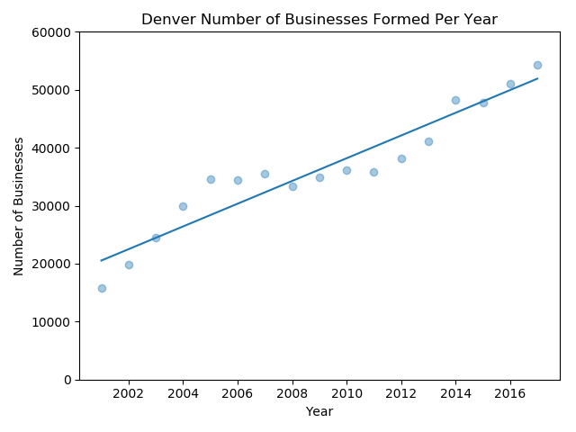

Real Per Capita GDP (chained 2009 dollars) Trends:

 | 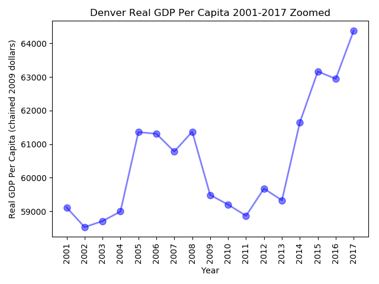
----- | -----
Real Per Capita GDP | Real Per Capita GDP Zoomed-in

###### Interpretation

The total number of businesses formed in the Denver Metro Area from 2001-2017 was 615,787. This is approximately 54% of the total companies in our study. Out of the Denver companies formed, the highest category of status was Delinquent with 45.2% of companies and Good Standing was second at 33.8% of companies. When looking at the types of companies formed during this time period, Limited Liability Companies were the preferred type with 76.9% of companies. Corporations were second with 19.2% of companies. The number of companies formed per year has gone up substantially since 2001. In 2001 there were approximately 18,000 new companies formed and in 2017 this number grew to over 50,000. Then we looked at real per capita GDP for Denver and found a low in 2011 at 59,000 and then strong growth to over 64,000 in 2017.

###### Comparison

When comparing Denver to the State, it has a higher percentage of businesses in a Delinquent state, and a lower percentage of companies in Good Standing. It has a higher percentage of Limited Liability Companies and a higher percentage of Corporations. Denver has a strong upward trend in the number of companies being formed. Denver also has a higher real per capita GDP than the state average, and has shown a strong upward trend since 2013. This makes us believe that Denver strengths include a strong economy and a large labor pool with a thriving start-up culture.

#### Grand Junction Metro Area

Total Number of Businesses Formed in Grand Junction 2001-2017: 25,141

Status of Businesses Formed:

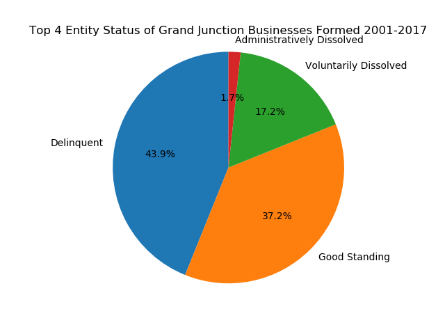

Entity Status  | Total Businesses
------------- | -------------
Delinquent | 10,878
Good Standing | 9,222
Voluntarily Dissolved | 4,269
Administratively Dissolved | 418

Type of Businesses Formed:

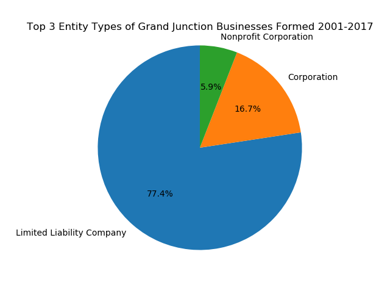

Entity Type  | Total Businesses
------------- | -------------
Limited Liability Company  | 19,052
Corporation  | 4,105
Nonprofit Corporation  | 1,457

Number of Businesses Formed Per Year:

Real Per Capita GDP (chained 2009 dollars) Trends:

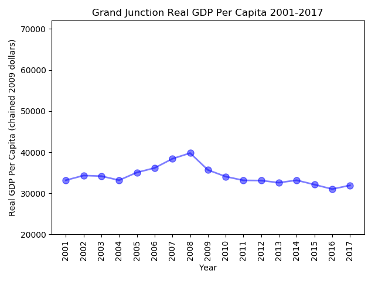 | 
----- | -----
Real Per Capita GDP | Real Per Capita GDP Zoomed-in

###### Interpretation

The total number of businesses formed in the Grand Junction Metro Area from 2001-2017 was 25,141. This is approximately 2% of the total companies in our study. Out of the Grand Junction companies formed, the highest category of status was Delinquent with 43.9% of companies and Good Standing was second at 37.2% of companies. When looking at the types of companies formed during this time period, Limited Liability Companies were the preferred type with 77.4% of companies. Corporations were second with 16.7% of companies. The number of companies formed per year has increased since 2001. In 2001 there were approximately 550 new companies formed and in 2017 this number grew to approximately 2000. Then we looked at real per capita GDP for Grand Junction and found a peak high in 2008 before the recession at 40,000 and then a strong decline until 2016 with real per capita GDP at approximately 32,000. 2017 saw a slight increase in real per capita GDP.

###### Comparison

When comparing Grand Junction to the State, it has a higher percentage of businesses in a Delinquent state, and a higher percentage of companies in Good Standing. It has a higher percentage of Limited Liability Companies and a lower percentage of Corporations. Grand Junction has shown an upward trend in the number of companies being formed in recent years, getting back to pre-recession numbers. Grand Junction has a lower real per capita GDP than the state average, and has shown a strong downward trend since 2008. This makes us believe that Grand Junction might have felt the affects of the 2008-2009 recession harder than the other metro areas in Colorado, assuming the recession might be the reason or at least heavily influenced the decline.

#### Greeley Metro Area

Total Number of Businesses Formed in Greeley 2001-2017: 44,006

Status of Businesses Formed:

Entity Status  | Total Businesses
------------- | -------------
Delinquent | 18,118
Good Standing | 16,975
Voluntarily Dissolved | 7,372
Administratively Dissolved | 847

Type of Businesses Formed:

Entity Type  | Total Businesses
------------- | -------------
Limited Liability Company  | 34,374
Corporation  | 6,943
Nonprofit Corporation  | 1,871

Number of Businesses Formed Per Year:

Real Per Capita GDP (chained 2009 dollars) Trends:

 | 
----- | -----
Real Per Capita GDP | Real Per Capita GDP Zoomed-in

###### Interpretation

The total number of businesses formed in the Greeley Metro Area from 2001-2017 was 44,006. This is approximately 4% of the total companies in our study. Out of the Greeley companies formed, the highest category of status was Delinquent with 41.8% of companies and Good Standing was second at 39.2% of companies. When looking at the types of companies formed during this time period, Limited Liability Companies were the preferred type with 79.6% of companies. Corporations were second with 16.1% of companies. The number of companies formed per year has increased since 2001. In 2001 there were approximately 1000 new companies formed and in 2017 this number grew to approximately 4000. Then we looked at real per capita GDP for Greeley and found a steady decline until 2010-2011 with real per capita GDP bottoming out at below 30,000. Since 2011, Greeley has seen strong growth, especially in 2013, with real per capita GDP reaching 2001 levels of 36,000.

###### Comparison

When comparing Greeley to the State, it has a lower percentage of businesses in a Delinquent state, and a higher percentage of companies in Good Standing. It has a higher percentage of Limited Liability Companies and a lower percentage of Corporations. Greeley has shown a 4x growth in the number of companies being formed from 2001 to 2017, which is higher than the state average. Greeley has a lower real per capita GDP than the state average, but has shown a strong upward trend since 2011.

#### Fort Collins Metro Area

Total Number of Businesses Formed in Fort Collins 2001-2017: 64,084

Status of Businesses Formed:

Entity Status  | Total Businesses
------------- | -------------
Good Standing | 25,624
Delinquent | 24,670
Voluntarily Dissolved | 11,593
Administratively Dissolved | 1,274

Type of Businesses Formed:

Entity Type  | Total Businesses
------------- | -------------
Limited Liability Company  | 50,325
Corporation  | 9,709
Nonprofit Corporation  | 2,944

Number of Businesses Formed Per Year:

Real Per Capita GDP (chained 2009 dollars) Trends:

 | 
----- | -----
Real Per Capita GDP | Real Per Capita GDP Zoomed-in

###### Interpretation

The total number of businesses formed in the Fort Collins Metro Area from 2001-2017 was 64,084. This is approximately 6% of the total companies in our study. Out of the Fort Collins companies formed, the highest category of status was Good Standing with 40.6% of companies and Delinquent was second at 39.1% of companies. When looking at the types of companies formed during this time period, Limited Liability Companies were the preferred type with 79.9% of companies. Corporations were second with 15.4% of companies. The number of companies formed per year has increased since 2001. In 2001 there were approximately 1800 new companies formed and in 2017 this number grew to approximately 5500. Then we looked at real per capita GDP for Fort Collins and found a steady increase form 2001-2017 with real per capita GDP starting at below 38,000 and ending in 2017 at approximately 44,000.

###### Comparison

When comparing Fort Collins to the State, it has a lower percentage of businesses in a Delinquent state, and a higher percentage of companies in Good Standing. It has a higher percentage of Limited Liability Companies and a lower percentage of Corporations. Fort Collins has shown an approximate 3x growth in the number of companies being formed from 2001 to 2017, which is slightly higher than the state average. Fort Collins has a lower real per capita GDP than the state average, but has shown a strong upward trend since 2001.

#### Pueblo Metro Area

Total Number of Businesses Formed in Pueblo 2001-2017: 14,930

Status of Businesses Formed:

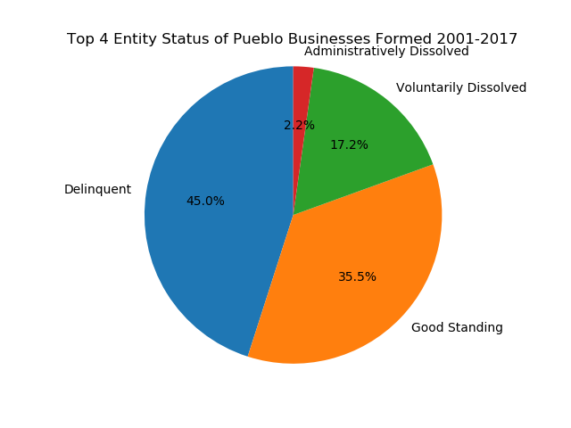

Entity Status  | Total Businesses
------------- | -------------
Delinquent | 6,617
Good Standing | 5,212
Voluntarily Dissolved | 2,533
Administratively Dissolved | 325

Type of Businesses Formed:

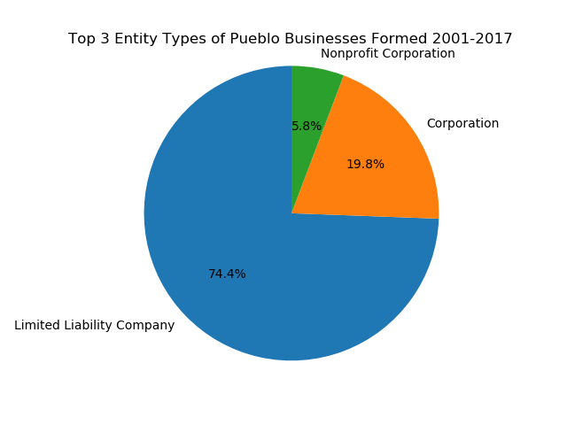

Entity Type  | Total Businesses
------------- | -------------
Limited Liability Company  | 10,872
Corporation | 2,896
Nonprofit Corporation | 842

Number of Businesses Formed Per Year:

Real Per Capita GDP (chained 2009 dollars) Trends:

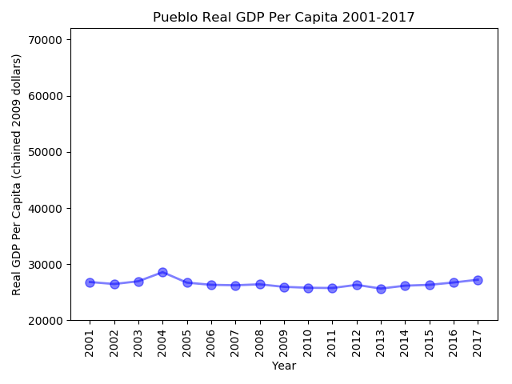 | 
----- | -----
Real Per Capita GDP | Real Per Capita GDP Zoomed-in

###### Interpretation

The total number of businesses formed in the Pueblo Metro Area from 2001-2017 was 14,930. This is approximately 1% of the total companies in our study. Out of the Pueblo companies formed, the highest category of status was Delinquent with 45.0% of companies and Good Standing was second at 35.5% of companies. When looking at the types of companies formed during this time period, Limited Liability Companies were the preferred type with 74.4% of companies. Corporations were second with 19.8% of companies. The number of companies formed per year has increased since 2001. In 2001 there were approximately 500 new companies formed and in 2017 this number grew to a little over 1250. Then we looked at real per capita GDP for Pueblo and found a steady decline from a peak real per capita GDP of 28,500 in 2004 to a bottom in 2013 below 26,000. Since 2013, Pueblo has seen steady growth, with real per capita GDP above 27,000 in 2017.

###### Comparison

When comparing Pueblo to the State, it has a higher percentage of businesses in a Delinquent state, and a lower percentage of companies in Good Standing. It has a lower percentage of Limited Liability Companies and a higher percentage of Corporations. Pueblo has shown a 2.5x growth in the number of companies being formed from 2001 to 2017, which is lower than the state average. Pueblo has a lower real per capita GDP than the state average, but has shown a strong upward trend since 2013.

## Data Sources

State Population Data: Colorado Department of Local Affairs
Link: https://demography.dola.colorado.gov/births-deaths-migration/data/components-change/

State GDP (millions of current dollars): U.S. Bureau of Economic Analysis, Total Gross Domestic Product for Colorado 2001-2017
Link: https://apps.bea.gov/itable/iTable.cfm?ReqID=70&step=1#reqid=70&step=1&isuri=1

State Per capita real GDP (chained 2012 dollars, not seasonally adjusted): U.S. Bureau of Economic Analysis 2001-2017
Link: https://apps.bea.gov/itable/iTable.cfm?ReqID=70&step=1#reqid=70&step=1&isuri=1

Total Per Capita Real GDP Denver-Aurora-Lakewood (chained 2009 dollars, not seasonally adjusted): U.S. Bureau of Economic Analysis, Total Per Capita Real Gross Domestic Product for Denver-Aurora-Lakewood, CO (MSA) [PCRGMP19740], retrieved from FRED, Federal Reserve Bank of St. Louis; April 10, 2019.
Link: https://fred.stlouisfed.org/series/PCRGMP19740

Total Per Capita Real GDP Colorado Springs (chained 2009 dollars, not seasonally adjusted): U.S. Bureau of Economic Analysis, Total Per Capita Real Gross Domestic Product for Colorado Springs, CO (MSA) [PCRGMP17820], retrieved from FRED, Federal Reserve Bank of St. Louis; April 10, 2019.
Link: https://fred.stlouisfed.org/series/PCRGMP17820

Total Per Capita Real GDP Boulder (chained 2009 dollars, not seasonally adjusted): U.S. Bureau of Economic Analysis, Total Per Capita Real Gross Domestic Product for Boulder, CO (MSA) [PCRGMP14500], retrieved from FRED, Federal Reserve Bank of St. Louis; April 10, 2019.
Link: https://fred.stlouisfed.org/series/PCRGMP14500

Total Per Capita Real GDP Pueblo (chained 2009 dollars, not seasonally adjusted): U.S. Bureau of Economic Analysis, Total Per Capita Real Gross Domestic Product for Pueblo, CO (MSA) [PCRGMP39380], retrieved from FRED, Federal Reserve Bank of St. Louis; April 10, 2019.
Link: https://fred.stlouisfed.org/series/PCRGMP39380

Total Per Capita Real GDP Fort Collins (chained 2009 dollars, not seasonally adjusted): U.S. Bureau of Economic Analysis, Total Per Capita Real Gross Domestic Product for Fort Collins, CO (MSA) [PCRGMP22660], retrieved from FRED, Federal Reserve Bank of St. Louis; April 10, 2019.
Link: https://fred.stlouisfed.org/series/PCRGMP22660

Total Per Capita Real GDP Greeley (chained 2009 dollars, not seasonally adjusted): U.S. Bureau of Economic Analysis, Total Per Capita Real Gross Domestic Product for Greeley, CO (MSA) [PCRGMP24540], retrieved from FRED, Federal Reserve Bank of St. Louis; April 10, 2019.
Link: https://fred.stlouisfed.org/series/PCRGMP24540

Total Per Capita Real GDP Grand Junction (chained 2009 dollars, not seasonally adjusted): U.S. Bureau of Economic Analysis, Total Per Capita Real Gross Domestic Product for Grand Junction, CO (MSA) [PCRGMP24300], retrieved from FRED, Federal Reserve Bank of St. Louis; April 10, 2019.
Link: https://fred.stlouisfed.org/series/PCRGMP24300

Business Entity Data: CDOS - Colorado Department of State (https://www.sos.state.co.us/biz/BusinessEntityCriteriaExt.do)
Link: https://data.colorado.gov/Business/Business-Entities-in-Colorado/4ykn-tg5h
