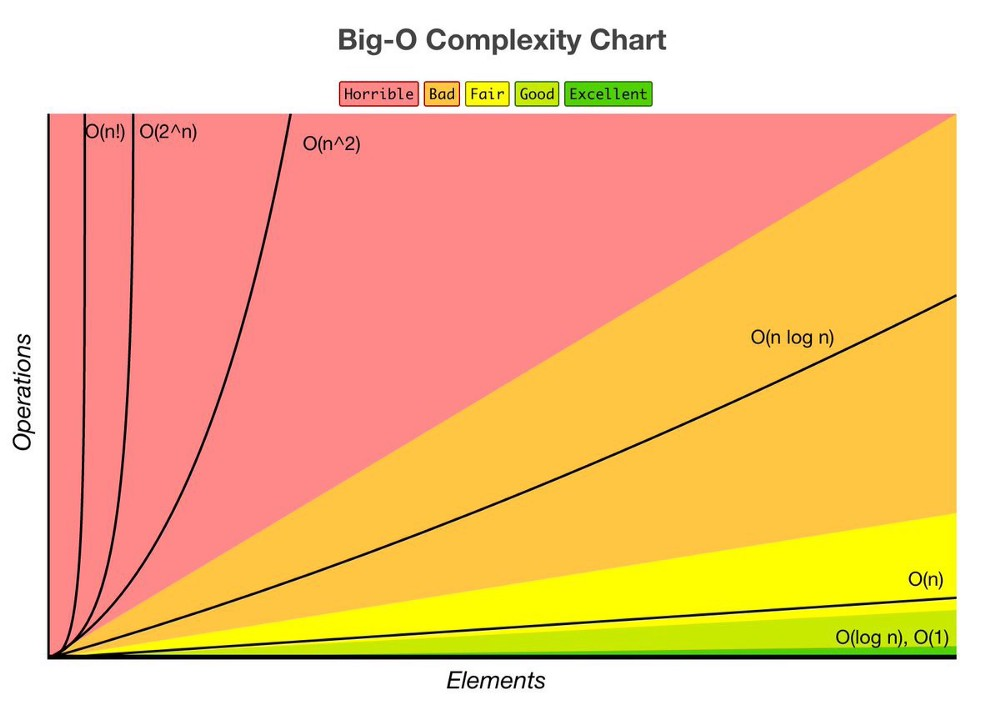
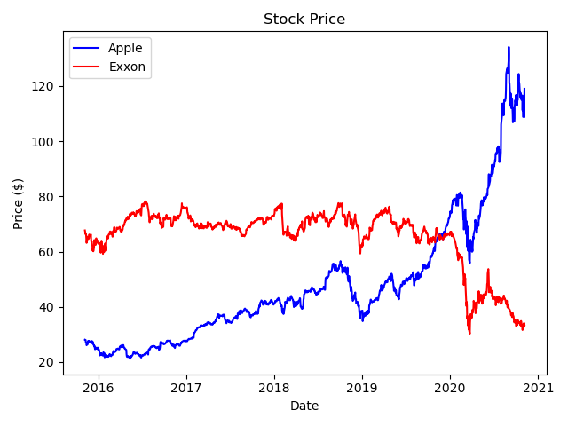

# Portfolio

### [Colorado Business Formation and Economic Exploratory Analysis](https://github.com/ryancur/Colorado-Business-Formation.git)

April 2019

Analyzed the number of new businesses formed in Colorado between 2001-2017. Compared the growth in new businesses to real GDP per capita across the state and seven (7) metro areas.

Technologies: Python, Pandas, Numpy, Matplotlib, Scikit-learn, Statsmodels, Jupyter Notebook

Linear Regression | Data Visualization | Data Cleaning

Data: Available

Code: Available

---

### [Data Structures & Algorithms - BigO Analysis](https://github.com/ryancur/Data-Structures-Algorithms-BigO)

April 2020

Source: http://bigocheatsheet.com/

Project 1 for Udacity's Data Structures and Algorithms course. Tasked with solving five (5) programming challenges and then calculating the BigO notation for each solution.

Technologies: Python

BigO Analysis

Data: Available

Code: Available

---

### [Alpha Research - Momentum](https://github.com/ryancur/Alpha-Research-Momentum)

April 2020 (original)

Updated: November 2020 (Data and Code)

Description

Technologies: Python, Pandas, Numpy, Matplotlib, Scipy

Data: Available

Code: Available
